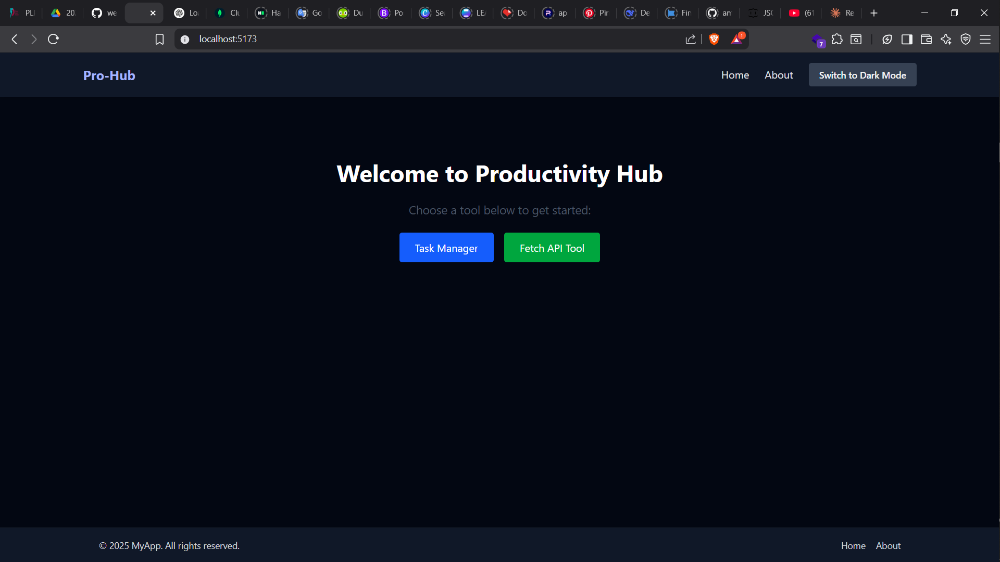
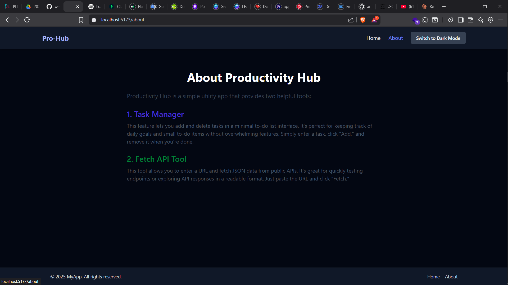
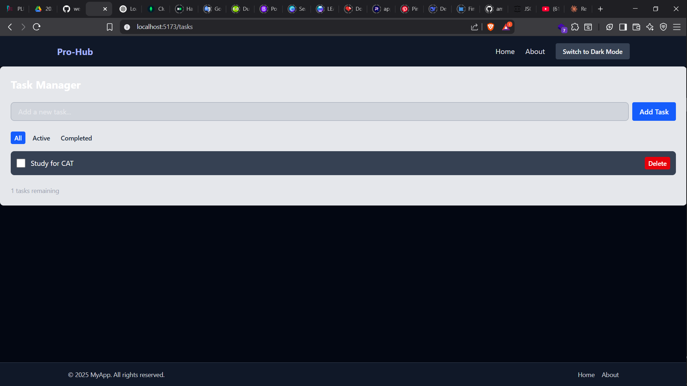
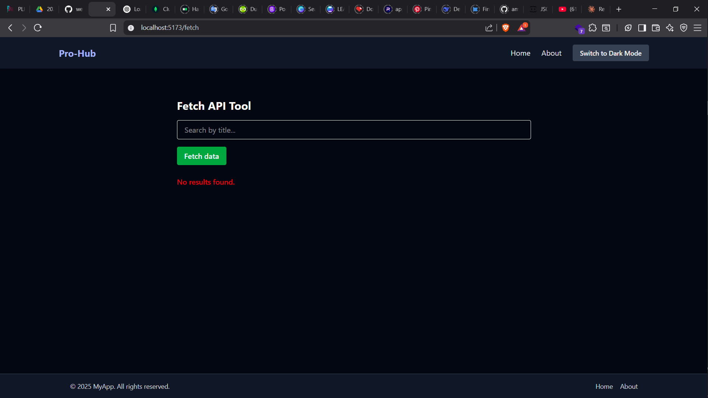

# React Task & API Manager

A simple React application that allows users to:

- Manage tasks with localStorage persistence
- Fetch data from a public API
- Toggle light/dark themes using Tailwind CSS
- Navigate between pages using React Router

---

## 🚀 Features

- ✨ Responsive layout using Tailwind CSS
- 🌗 Light/Dark theme toggle
- ✅ Task creation, filtering, and deletion
- 📡 Fetch and paginate remote API data
- 📁 Organized file structure with components, layout, pages

---

## Tech Stack

Frontend - React(Vite), JSX, Tailwind CSS
State - useState, useEffect


## 📂 Project Structure

```

src/
├── assets/ # Static assets like images
├── components/ # Reusable UI components (e.g., TaskManager, ApiFetcher)
├── layout/ # Shared layout components (Navbar, Footer)
├── pages/ # Route-based pages (Home, About)
├── App.jsx # Main application component
├── main.jsx # ReactDOM.render / createRoot entry
├── index.css # Tailwind CSS + base styles'

```

## 🛠️ Getting Started

### Clone the repo
```bash 
git clone https://github.com/PLP-MERN-Stack-Development/week-3-react-js-assignment-ambagwa.git
cd week-3-react-js-assignment-ambagwa
```

**Install dependencies:**

```bash
pnpm install
# or
npm install
```
## Run application
```bash
pnpm run dev 
# or
npm run dev
```

## Screenshots

### Home Page


### About Page


### TaskManager Page


### Fetch-API Page


## Live Demo
[](https://plp-mern-stack-development.github.io/week-3-react-js-assignment-ambagwa/)
